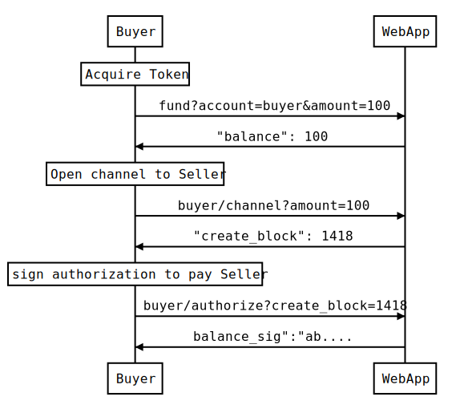
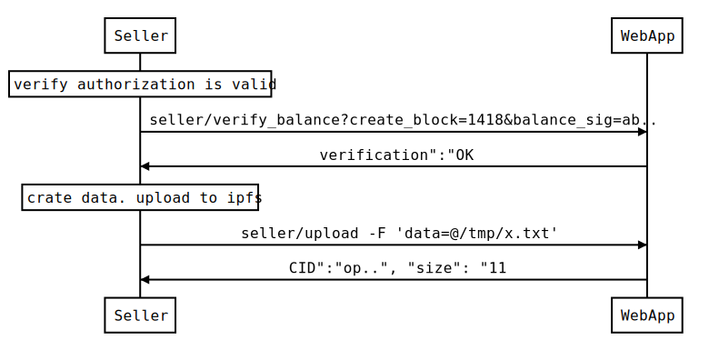
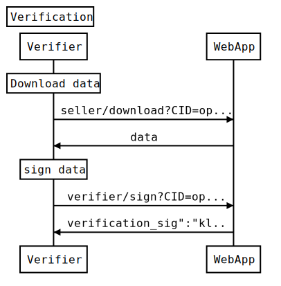
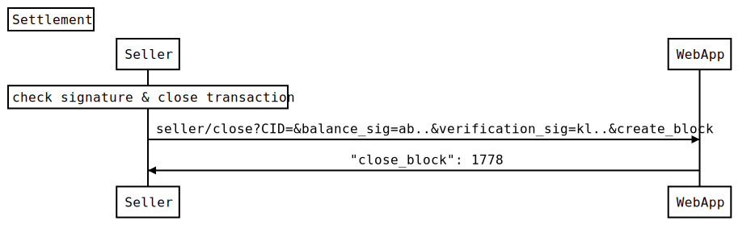

# REST endpoints


(Documentation needs to be updated)

The server require an external chain that needs to be started
separately. A _reset_parity.sh_ script will start a locally configured chain with the
setup required for the App.

An example session can work like this:

* Buyer acquires SCRY tokens:

```
curl "localhost:5000/fund?account=buyer&amount=100"

{ "balance": 100 }
```

* It is possible to check buyer, seller, verifier, owner & contract's token
  balances at any time:

```
curl localhost:5000/balance?account=buyer

{ "balance": 100 }
```

* Buyer opens channel to Seller:

```
curl localhost:5000/buyer/channel

{ "create_block": 1418 }
```

* Buyer signs authorization to pay Seller

```
curl localhost:5000/buyer/authorize?create_block=1418

{
  "balance_sig":
"aabc0673229de2bb056a8745b93636128483812a0cc66da3c8b95ae91c47f055522b9a3d13f92ddb87d08319a2cd4b10d6b845b1b705391e7fa3f610b7f1f7d41b"
}
```



* Buyer's authorization is transferred to Seller, and he verifies that it is
  correct

```
curl
localhost:5000/seller/verify_balance?create_block=1418&balance_sig=aabc0673229de2bb056a8745b93636128483812a0cc66da3c8b95ae91c47f055522b9a3d13f92ddb87d08319a2cd4b10d6b845b1b705391e7fa3f610b7f1f7d41b

{ "verification":"OK" }
```

* Seller creates the data, and uploads it to IPFS. This can be done
  independently or using the server

```
curl localhost:5000/seller/upload -F 'data=@/tmp/x.txt'

{
  "CID":
"QmemJwwgeGckPXbuk8ckzHvKxbueJQZ95QLy1J8gKnMdiB", "size": "11" }
```



* Seller's asks the Verifier to verify and sign the ipfs CID. Verifier downloads
  the data independently or using the server

```
curl -v
"localhost:5000/seller/download?CID=QmPrafFmEqqQDUgepoVShKUDzdxWtd8UtwA211RE47LBZ"
```

and signs it

```
curl
localhost:5000/verifier/sign?CID=QmPrafFmEqqQDUgepoVShKUDzdxWtd8UtwA211RE47LBZd

{
  "verification_sig":
"4471e812f37b3d50808fde347e21f8c838df657da29a1ac126a2f85bbd4847b71de516f4ca8d2b26587f4ddc0ac2b78cf18cb03a12097800cbb281f26e5c2ada1b"
}
```



* Seller verifies if the signature is OK - TODO
* Seller takes both signatures and closes the transaction. The Buyer's rewards
  are distributed

```
curl
"localhost:5000/seller/close?CID=QmPrafFmEqqQDUgepoVShKUDzdxWtd8UtwA211RE47LBZd&balance_sig=aabc0673229de2bb056a8745b93636128483812a0cc66da3c8b95ae91c47f055522b9a3d13f92ddb87d08319a2cd4b10d6b845b1b705391e7fa3f610b7f1f7d41b&verification_sig=4471e812f37b3d50808fde347e21f8c838df657da29a1ac126a2f85bbd4847b71de516f4ca8d2b26587f4ddc0ac2b78cf18cb03a12097800cbb281f26e5c2ada1b&create_block=1418"

{ "close_block": 1778 }
```


